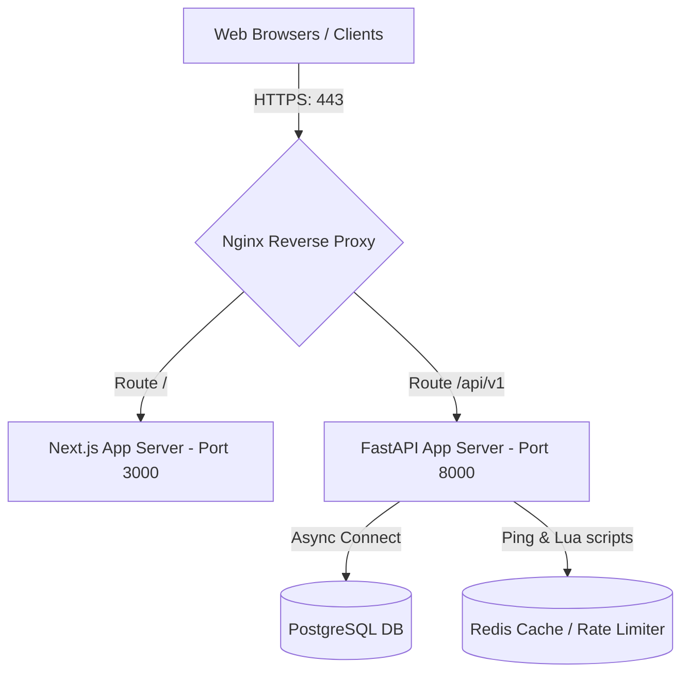

# QuizVerse AI Production Deployment Guide

This document outlines the architecture, environment configurations, and steps required to deploy QuizVerse AI into a high-availability production environment.

---

## 1. System Architecture

QuizVerse AI is built on a containerized, stateless, three-tier architecture:
- **Presentation Layer**: Next.js 15 frontend, containerized and served via Nginx reverse proxy.
- **Application Layer**: FastAPI (Python 3.11) backend running under Uvicorn, fully stateless.
- **Data & Caching Layer**: PostgreSQL (PostgreSQL 16) for persistent data store, Redis (Redis 7) for rate-limiting, and WebSocket connection Pub/Sub synchronization.

---

## 2. Environment Variables & Secret Management

Do not store production secrets in raw `.env` files. Instead, fetch them dynamically from a secret manager (e.g., AWS Secrets Manager, GCP Secret Manager, HashiCorp Vault) or inject them directly via secure environment variables in Kubernetes/ECS.

### Critical Secrets Reference Table

| Variable | Description | Required in Production | Secure Alternative |
| :--- | :--- | :---: | :--- |
| `DATABASE_URL` | Async connection string to PostgreSQL | **Yes** | AWS Secrets Manager / Vault |
| `REDIS_PASSWORD` | Password for Redis container/cluster | **Yes** | Inject via Docker Secret / Env |
| `SECRET_KEY` | JWT signing key (min 32 bytes cryptographically secure) | **Yes** | Generate via openssl rand |
| `GEMINI_API_KEY` | API Key for Gemini provider | No (Uses mock if empty) | Secret Manager |
| `OPENAI_API_KEY` | API Key for OpenAI provider | No (Uses mock if empty) | Secret Manager |
| `GROQ_API_KEY` | API Key for Groq provider | No (Uses mock if empty) | Secret Manager |
| `SMTP_PASSWORD` | Credentials for outgoing mail system | **Yes** (if auth req) | Secret Manager |

---

## 3. Database Configurations & Migrations

### Migrations
Alembic is used to manage database schema updates.
1. Run migrations at startup or inside the release stage of your deployment pipeline:
   `alembic upgrade head`
2. **Zero-Downtime Rule**: Schema changes must be backward-compatible (e.g., add columns as nullable first, migrate data, then add constraints in a later release).

### Database Backups
Automatic hourly/daily backups must be configured. Refer to the backup scripts in the `scripts/` directory:
- Backup Execution: `/bin/bash scripts/db_backup.sh`
- Restoration: `/bin/bash scripts/db_restore.sh`
Store backup artifacts in private, encrypted S3 buckets with lifecycle rules to prune files older than 30 days.

---

## 4. HTTPS & Reverse Proxy Setup

Nginx is configured to terminate TLS and forward requests to internal container sockets.

### Production SSL/TLS Certificates
1. Provision certificates using Let's Encrypt / Certbot:
   `certbot certonly --webroot -w /var/www/certbot -d quizverse.ai -d www.quizverse.ai`
2. Mount the certificates inside the Nginx container at `/etc/nginx/ssl/quizverse.crt` and `/etc/nginx/ssl/quizverse.key`.
3. Set Nginx configuration to support HTTP/2 and disable obsolete TLS versions (TLS 1.0, 1.1).

---

## 5. Horizontal Scaling & High Availability

QuizVerse AI supports horizontal scaling across multiple application instances:

### Stateless API & WebSocket Synchronization
- **Redis Pub/Sub**: The backend is configured to use Redis Pub/Sub for WebSockets. When a user connects to Instance A, and a broadcast event is triggered on Instance B, Redis Pub/Sub synchronizes the event so all instances update their connected WebSockets.
- **Session Tokens**: Authentication uses self-contained stateless JWTs. No server-side session state is stored, meaning client requests can land on any backend replica.
- **Load Balancer (ALB)**: Deploy an AWS Application Load Balancer or Nginx Upstream cluster with round-robin routing and active health checks pointing to `/health`.

---

## 6. Production Monitoring & Logging

### Structured Logging
FastAPI has been configured with `JSONFormatter` to print structured JSON logs in production. Log processors (fluentd, logstash) can scrape the container stdout and forward them to Elasticsearch/Kibana or CloudWatch.

### APM and Metrics
- **Prometheus**: Scrape metrics from Redis, PostgreSQL, and application hosts.
- **OpenTelemetry**: Integrate the OpenTelemetry SDK in FastAPI to trace request pathways through DB queries and AI provider requests.
- **Sentry**: Set up Sentry in `backend/app/main.py` for real-time error tracking and notification.
